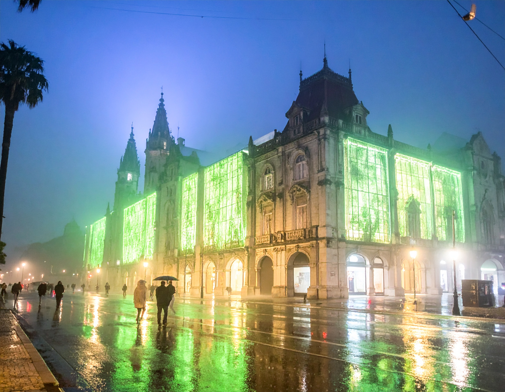

# 🍃 Mercado do Ver-o-Peso Futurista  

📸 Um experimento em **fotografia digital hiper-realista** com IA, recriando o icônico Mercado do Ver-o-Peso (Belém/PA) em um **futuro utópico-distópico**.  

✨ Tecnologias: Gemini (LLM), Adobe Firefly (imagens), VEO 2 (vídeo).  

🔗 [📖 Leia o projeto completo](./PROJETO_VIDEO.md)  
🎥 [Assista ao vídeo](https://youtu.be/rbiFXmS9Q80))

---

## 🌆 Preview  

---
